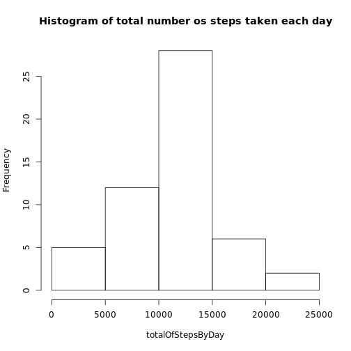
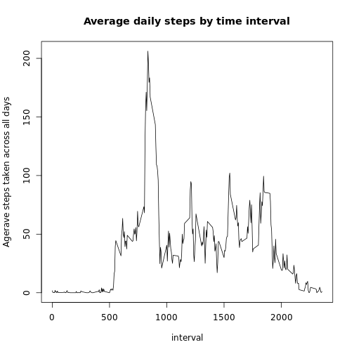
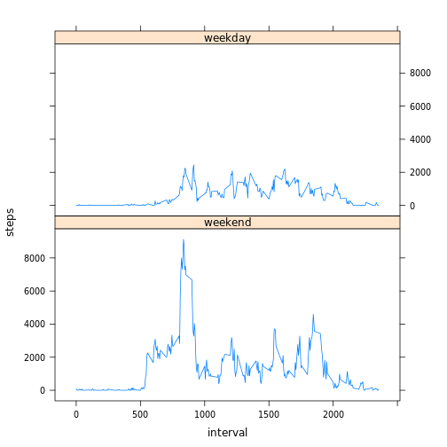

## Loading and preprocessing the data

```r
activityFile <- unz("activity.zip","activity.csv")
activityData <- read.csv(activityFile, colClasses = c("numeric","Date","numeric"))
```


## What is mean total number of steps taken per day?

```r
## Removing NA's values as they are unkown values - CAN NOT BE TREATED AS ZERO
activityDataWithoutNAs = activityData[!is.na(activityData$steps),]

stepsByDay = aggregate(activityDataWithoutNAs$steps,
                       by=list(date=activityDataWithoutNAs$date), FUN=sum)
hist(stepsByDay$x,main = "Histogram of total number os steps taken each day", xlab="totalOfStepsByDay")
```

 
Calculating the mean value:

```r
mean(stepsByDay$x)
```

```
## [1] 10766.19
```
Calculating the median value:

```r
median(stepsByDay$x)
```

```
## [1] 10765
```


## What is the average daily activity pattern?

Aggregating and removing the NA's in the same function (Just to train in a different way!)

```r
avgStepsByTime <- aggregate(steps ~ interval, data = activityData, mean, na.rm=TRUE)

## Plotting the result
plot(avgStepsByTime,type="l",main="Average daily steps by time interval",ylab="Agerave steps taken across all days")
```

 

Which 5-minute interval, on average across all the days in the dataset, contains the maximum number of steps?

```r
avgStepsByTime[avgStepsByTime$steps == max(avgStepsByTime$steps),]
```

```
##     interval    steps
## 104      835 206.1698
```


## Imputing missing values
The total number of missing values in the dataset (i.e. the total number of rows with NAs):

```r
dim(activityData[is.na(activityData$steps),])[1]
```

```
## [1] 2304
```

Filling in all of the missing values in the dataset with the mean for that 5-minute interval across all days. And creates a new dataset that is equal to the original dataset but with the missing data filled in.

```r
activityDataWithMeanValues <- activityData
for (interval in avgStepsByTime$interval) {
    activityDataWithMeanValues$steps[is.na(activityDataWithMeanValues$steps) & (activityDataWithMeanValues$interval == interval)]  <- avgStepsByTime$steps[avgStepsByTime$interval == interval]
}
```

A histogram of the total number of steps taken each day:

```r
stepsByDayWithMeanValues = aggregate(steps ~ date,data = activityDataWithMeanValues, sum)
meanOFstepsByDayWithMeanValues <- format(mean(stepsByDay$x), digits = 7)
medianOFstepsByDayWithMeanValues <- format(median(stepsByDay$x), digits = 7)

hist(stepsByDay$x,main = "Histogram of total number os steps taken each day", xlab="totalOfStepsByDay")
```

 
  
The new dataset with average values has the mean equal to **10766.19** and median equal to **10765**. As we can see, the histogram, mean and median features of this new dataset does not differ from the dataset without the NA values. In this case, here is no impact of imputing generated missing data on the estimates of the total daily number of steps. **But why? Let's see:**


```r
explainData <- aggregate(activityData$steps, by=list(date=activityData$date), function (x) sum(is.na(x)))
countDaysWithNA <- dim(explainData[explainData$x > 0,])[1]
```

If we look further in the data, we can see that are **8 days** with NA values and all of them have NA values for the all 288 possible intervals:


```r
library(xtable)
explainData$date <- as.character(explainData$date)
print(xtable(explainData[explainData$x > 0,]), type="html")
```

<!-- html table generated in R 3.2.2 by xtable 1.7-4 package -->
<!-- Sat Sep 12 15:45:20 2015 -->
<table border=1>
<tr> <th>  </th> <th> date </th> <th> x </th>  </tr>
  <tr> <td align="right"> 1 </td> <td> 2012-10-01 </td> <td align="right"> 288 </td> </tr>
  <tr> <td align="right"> 8 </td> <td> 2012-10-08 </td> <td align="right"> 288 </td> </tr>
  <tr> <td align="right"> 32 </td> <td> 2012-11-01 </td> <td align="right"> 288 </td> </tr>
  <tr> <td align="right"> 35 </td> <td> 2012-11-04 </td> <td align="right"> 288 </td> </tr>
  <tr> <td align="right"> 40 </td> <td> 2012-11-09 </td> <td align="right"> 288 </td> </tr>
  <tr> <td align="right"> 41 </td> <td> 2012-11-10 </td> <td align="right"> 288 </td> </tr>
  <tr> <td align="right"> 45 </td> <td> 2012-11-14 </td> <td align="right"> 288 </td> </tr>
  <tr> <td align="right"> 61 </td> <td> 2012-11-30 </td> <td align="right"> 288 </td> </tr>
   </table>

If some of the intervals in the days listed above had values, our strategy of including the missing values could alter the the histogram and the mean/median values.

## Are there differences in activity patterns between weekdays and weekends?


```r
library(timeDate)
activityDataWithoutNAs$weekday <- factor(isWeekday(activityDataWithoutNAs$date), levels=c(TRUE,FALSE), labels = c('weekend', 'weekday'))
avgStepsByTimeWeekday <- aggregate(steps ~ weekday + interval, data = activityDataWithoutNAs,sum)
library(lattice)
xyplot(steps ~ interval | weekday, data  = avgStepsByTimeWeekday, type = "l",layout=c(1,2))
```

 
